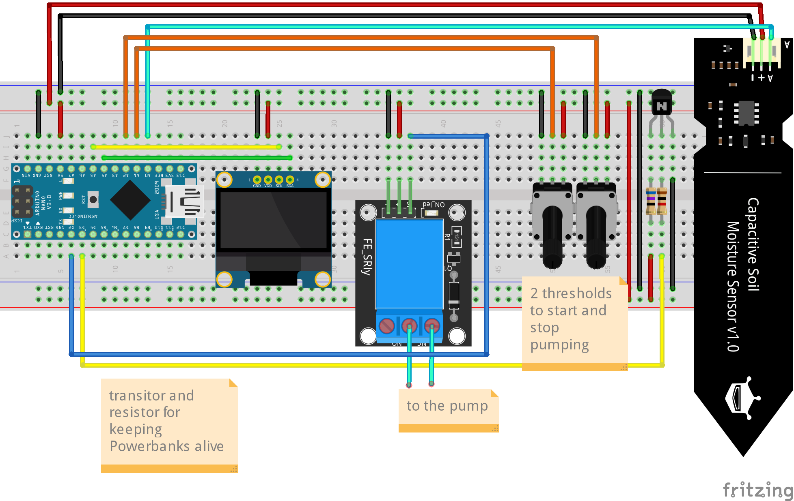

# arduino-watering #
 An enhanced watering system for plants

## Parts (no affiliate links) ##
 These parts are only an example of what can be used. Listed below are only the main parts. For Example I have used some shrink tubing, too.

* Arduino Nano Every ([Arduino Nano Every (3 Boards Pack) ](https://www.amazon.de/gp/product/B07YQ56B6Q/))
* Display ([AZDelivery 0,96 Zoll OLED Display I2C 128 x 64 Pixel I2C](https://www.amazon.de/gp/product/B01L9GC470/))
* Relais ([5x AZDelivery Relais 5V KY-019](https://www.amazon.de/gp/product/B07V1X2RSP/))
* Hygrometer ([3x AZDelivery Hygrometer Modul V1.2](https://www.amazon.de/gp/product/B07V2BBVQR/))
* Pump ([flintronic Aquarium Pumpe (usb Pump)](https://www.amazon.de/gp/product/B07TW39QXP/))
* Hose ([9/12 mm hose](https://www.amazon.de/gp/product/B000H6SRM0/))
* Transistor(s) ([Set](https://www.amazon.de/gp/product/B07HRKJS2W/))
* Resistors ([Set](https://www.amazon.de/gp/product/B07DGVR9J6/))
* Potentiometer ([Set](https://www.amazon.de/gp/product/B07W96SDJW/))
* maybe a Powerbank 

## Wiring (Fritzing)

## The Code
 *follows*

## Description
 *follows*

